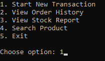
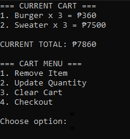
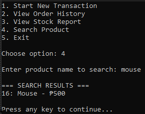
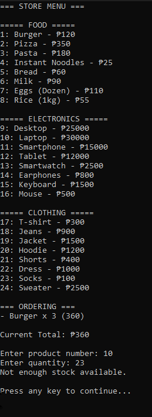
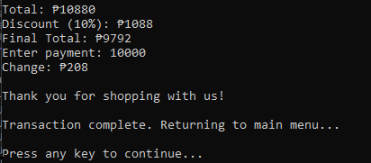
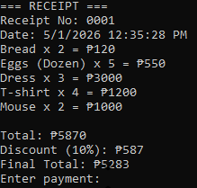

# Shopping Cart System in C#
> Suzanne Antonette F. Gurion | BSIT 1-1

---

## Project Description
This project is a **console-based Shopping Cart System** developed using C#. It allows users to select products, search items, manage a shopping cart, validate inputs, and process transactions with stock tracking and receipt generation.

The system ensures:
- Users cannot enter invalid inputs
- Stock cannot go below zero
- Cart items can be managed before checkout
- Transactions are properly recorded with receipts
- Order history is maintained during program execution

This project demonstrates object-oriented programming, arrays, loops, conditional statements, and input validation.

---

## Part 2: Enhanced Features Implemented

### 1. Cart Management System

The program now allows full cart control before checkout:
- View cart items
- Remove items
- Update quantity
- Clear cart
- Checkout option

Each update properly adjusts product stock to prevent inconsistencies.

---

### 2. Product Search Feature

A search function was added to allow users to find products by name.

Example:
Enter product name to search: "mouse"
Search results:

16. Mouse - ₱500

Displays matching products with product number, name, and price.

---

### 3. Product Categories

Products are grouped into categories:
- Food
- Electronics
- Clothing

Users can browse products organized per category for easier selection.

---

### 4. Stock Management & Reorder Alert
Stock is automatically updated during transactions.

After checkout, the system displays low stock warnings:
- Items with RemainingStock <= 5 are flagged as LOW STOCK

Example:
LOW STOCK ALERT:
Mouse has only 2 left.

---

### 5. Payment Validation System

The checkout process now validates payment properly:
- Only numeric input is accepted
- Payment must be >= final total
- System re-prompts until valid payment is entered
- Change is automatically computed

Example:
Final Total: ₱5200
Enter payment: 5000
Insufficient payment.
Enter payment: 6000
Change: ₱800

---

### 6. Receipt Generation System

Each transaction generates a receipt containing:
- Receipt number
- Date and time of purchase
- List of items purchased
- Total amount
- Discount (if applicable)
- Final total
- Payment amount
- Change

---

### 7. Order History
All completed transactions are stored in an array during runtime.

Users can view:
- Receipt number
- Final total of each transaction

Example:
ORDER HISTORY
Receipt #0001 - ₱5200
Receipt #0002 - ₱1800

---

### 8. Improved Input Validation
All Y/N prompts now use strict validation:
- Only accepts Y or N
- Keeps re-prompting until valid input is entered

---

### 9. Fixed Transaction Flow Issue
Fixed issue where after completing a transaction, the system incorrectly continued adding items.

Now:
- After checkout → receipt is shown
- Program properly returns to main menu
- New transaction only starts when selected

---

## Meaningful Commits

1. Initial project structure and product system setup  
2. Implement cart management and stock handling improvements  
3. Add product search and category filtering system  
4. Fix transaction flow and improve Y/N validation handling  
5. Add receipt generation, payment validation, and order history  

---

## AI Usage

AI tools (ChatGPT) were used for **guidance, debugging, and improvement suggestions only**. All final code was written, tested, and modified by the developer.

### 🔹 How AI Was Used

- Helped identify and fix logical errors in program flow (especially loop issues where transactions repeated unexpectedly)
- Assisted in correcting structure of methods (e.g., proper placement of SearchProduct inside Program class)
- Explained and improved input validation techniques using:
  - `TryParse`
  - strict Y/N validation loops
- Guided improvements in cart logic (preventing duplicate entries and properly updating quantities)
- Helped design proper receipt structure (receipt number, datetime, totals, change computation)
- Suggested better organization of menu-driven console programs
- Assisted in debugging stock update logic to ensure correct deduction and restoration
- Helped improve readability and structure of code (clean separation of features into methods)

### 🔹 AI Contributions Applied in Code
- Fixed loop flow issue after checkout returning incorrectly to item input
- Improved Y/N validation into reusable method `GetYesOrNo()`
- Assisted in implementing search feature for product names
- Helped refine checkout logic with proper payment validation loop
- Guided structure of order history array storage

### 🔹 Final Note
All AI suggestions were reviewed, modified, and tested before being included in the final system implementation.

---

## Summary of System Improvements
- Fully functional cart management system
- Search and category filtering
- Payment validation with change computation
- Receipt generation with timestamp and receipt number
- Order history tracking
- Low stock alerts after checkout
- Improved program flow and validation stability